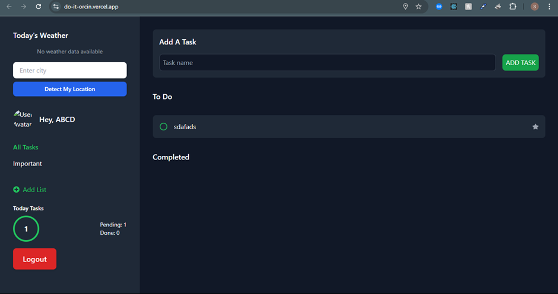
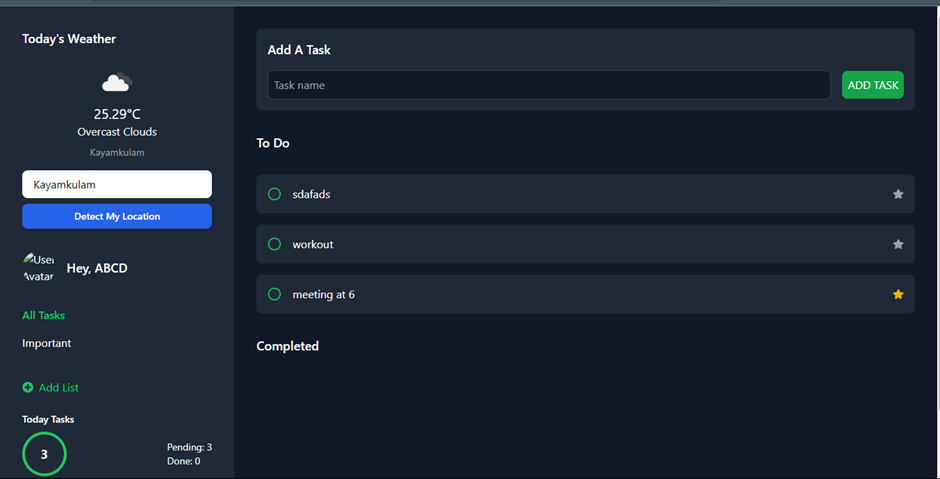
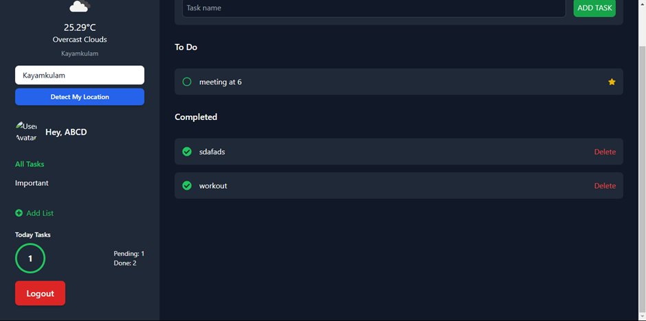

# React To-Do Application with API Integration

This To-Do application enhances the classic functionality with API integration, user authentication, and a responsive design. The app allows users to add, delete, and prioritize tasks while displaying weather data for outdoor-related tasks.

## Features

### 1. **Task Management**
- **Add Task:** Input tasks and add them to the list.
- **View Tasks:** Display all tasks in a list with filters for all tasks or only important ones.
- **Delete Task:** Remove tasks from the list.
- **Task Prioritization:** Assign priorities (Low, Medium, High) to tasks with visual cues.
- **Weather Integration:** Fetch weather data using a public API (e.g., OpenWeatherMap) for outdoor-related tasks.
- **Persistent Storage:** Tasks and authentication status are stored in `localStorage` for persistence across sessions.

### 2. **User Authentication**
- Simulated login/logout functionality with Redux.
- Task management is restricted to authenticated users.

### 3. **Responsive Design**
- Fully responsive and optimized for mobile, tablet, and desktop devices.
- Designed with **Tailwind css** using a mobile-first approach.

### 4. **State Management**
- **Redux Toolkit** is used for global state management of tasks and authentication.

---

## Demo

Check out the live demo: [To-Do App Demo](https://do-it-orcin.vercel.app/)

---

## Technologies Used

- **React**: Library for building user interfaces.
- **Redux Toolkit**: State management library.
- **React Router**: For navigation and routing.
- **Tailwind CSS**: Utility-first CSS framework.
- **OpenWeatherMap API**: For weather data.
- **LocalStorage**: For persistent data storage.

---

## Installation

### Prerequisites
- Node.js (14.x or higher)
- npm (6.x or higher)

### Steps
1. **Clone the repository**:
   ```bash
   git clone https://github.com/sudhirKsah/To-do-app
   cd To-do-app
   ```
2. **Install Dependencies**:
    ```bash
    npm install
    ```
3. **Start the development server**:
    ```bash
    npm run dev
    ```
4. **Open your browser and navigate to ```http://localhost:5173```**.
5. **Setup ```.env``` file in the root (optional)**
    ```VITE_WEATHER_API_KEY=your_api_key```

## Application Structure
- App.jsx: Main application component that manages authentication and routing.
- Tasks.jsx: Manages task list display and interactions.
- TaskInput.jsx: Handles task input functionality.
- TaskList.jsx: Displays all tasks with filters.
- Redux Store: Centralized store managing tasks and authentication.

## Screenshots
#### Login Page


#### Tasks View


#### Responsive Design

